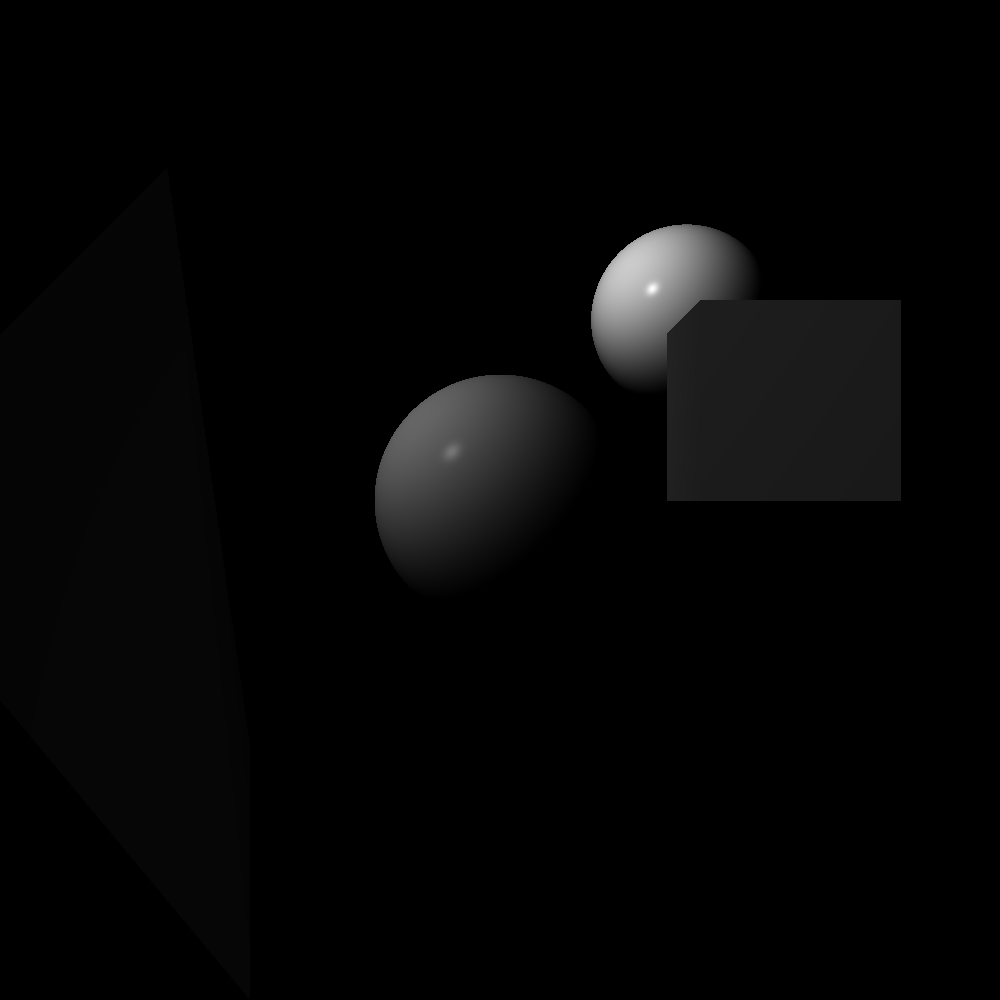

1.

cam -5.0 0.0 0.0 
normal 1.0 0.0 0.0 
up 0.0 1.0 0.0 
screen 1.0 
limit 20.0 
alpha 160.0 
width 1920 
height 1080 
light -5.0 0.0 0.0 
sphere 8.0 0.0 0.0 0.5 
box 0.0 0.0 0.0 1.0 1.0 1.0 
tetra 4.0 2.0 1.0 4.0 1.0 1.0 3.0 0.0 2.0 3.0 1.0 1.0 
sphere 5.5 1.0 1.0 0.5

 

 

2.

cam 0.0 0.0 0.0 
normal 1.0 0.0 0.0 
up 0.0 1.0 0.0 
screen 1.0 
limit 20.0 
alpha 160.0 
width 1000 
height 1000 
light 0.0 5.0 -5.0 
sphere 4.0 0.0 0.0 0.5 
box 5.0 0.0 1.0 6.0 1.0 2.0 
tetra 4.0 -2.0 -1.0 4.0 -1.0 -1.0 3.0 0.0 -2.0 3.0 1.0 -1.0 
sphere 5.5 1.0 1.0 0.5

3.

cam 0.0 0.0 0.0 
normal 1.0 0.0 0.0 
up 0.0 0.0 1.0 
screen 1.0 
limit 20.0 
alpha 150.0 
width 2000 
height 2000 
light 0.0 6.0 6.0 
sphere 4.0 0.0 0.0 0.5 
sphere 4.0 -1.0 1.0 0.5 
sphere 6.0 1.0 1.0 0.5 
sphere 10.0 2.0 2.0 2.0

 

 

